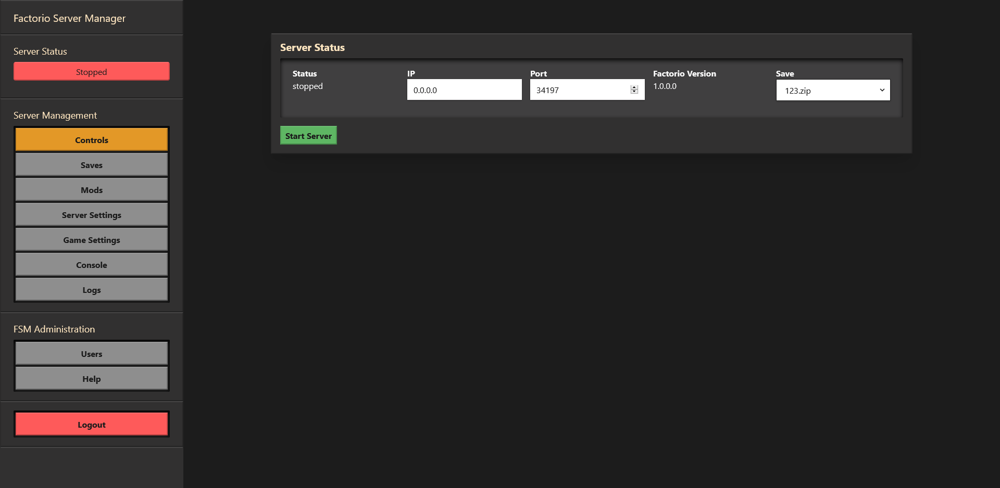
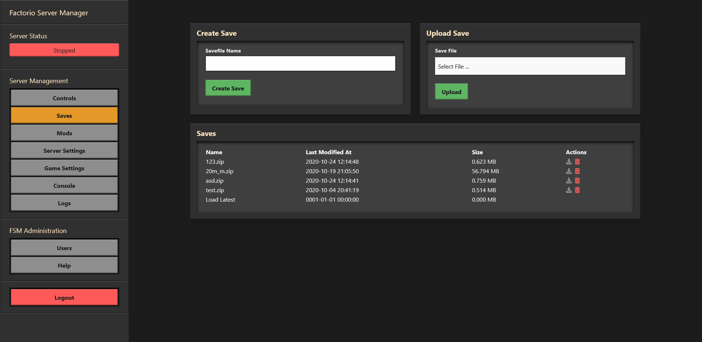
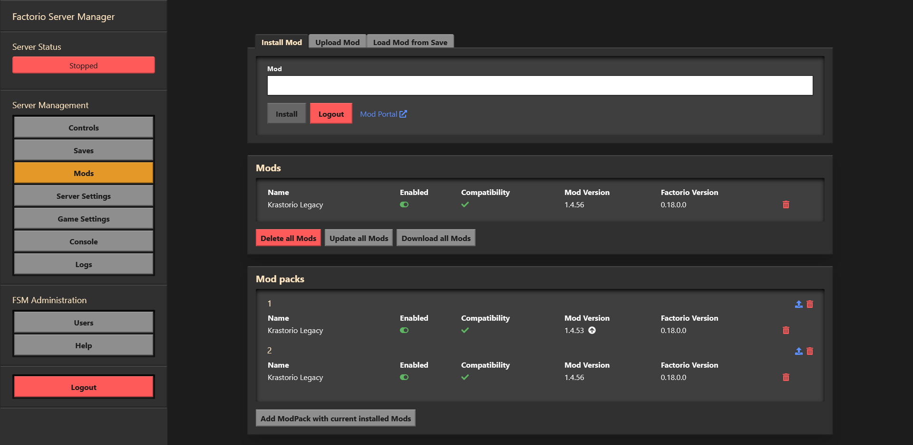

# Factorio Server Manager

### A tool for managing Factorio servers.
This tool runs on a Factorio server and allows management of the Factorio server, saves, mods and many other features.

## Features
* Allows control of the Factorio Server, starting and stopping the Factorio binary.
* Allows the management of save files, upload, download and delete saves.
* Manage installed mods, upload new ones and more
* Manage modpacks, so it is easier to play with different configurations
* Allow viewing of the server logs and current configuration.
* Authentication for protecting against unauthorized users
* Available as a Docker container

#### Manage Factorio Server

#### Manage save files

#### Manage mods

## [Installation and Usage](https://github.com/OpenFactorioServerManager/factorio-server-manager/wiki/Installation-and-Usage)

## [Development](https://github.com/OpenFactorioServerManager/factorio-server-manager/wiki/Development)

## Contributing
1. Fork it!
2. Checkout the develop branch, only use that as a base: `git checkout develop`
2. Create your feature branch: `git checkout -b my-new-feature`
3. Commit your changes: `git commit -am 'Add some feature'`
4. Add your changes a in human readable way into CHANGELOG.md
4. Push to the branch: `git push origin my-new-feature`
5. Submit a pull request, with `develop` as base :D

## Authors

* **Mitch Roote** - [roote.ca](https://roote.ca)
* **[knoxfighter](https://github.com/knoxfighter)**
* **[Jannaahs](https://github.com/jannaahs)**

## Special Thanks
- **[All Contributions](https://github.com/OpenFactorioServerManager/factorio-server-manager/graphs/contributors)**
- **mickael9** for reverseengineering the factorio-save-file: https://forums.factorio.com/viewtopic.php?f=5&t=8568#

## License

This project is licensed under the MIT License - see the [LICENSE.md](LICENSE.md) file for details
